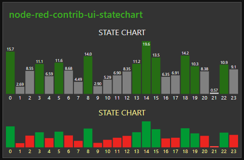

# node-red-contrib-ui-statechart
[![NPM version][npm-image]][npm-url]

[npm-image]: http://img.shields.io/npm/v/node-red-contrib-ui-statechart.svg
[npm-url]: https://npmjs.org/package/node-red-contrib-ui-statechart
## Description
Node-RED dashboard widget. Bar chart to visualize numeric values in relation, together with state represented by color.

State chart is special chart to combine visualization of value relations with state. Relation is between all values in series, not against some minimum, maximum or predefined value. That’s why there aren’t any minimum or maximum values presented.

State is fully under user control. Chart doesn't calculate state for the series.

## Configuration
### Series

Configuring the series is mandatory. Series presented as name of the bar. Make them short as they do not rotate or scale.
Configuration input of the series must be filled with `comma separated string`. Avoid space unless it is intentional.

For example: `dog,cat,cow,sheep,goat`

### Series shortcuts
In addition the series can be automatically generated for 24 hours.  
By using shortcut `24H` the series generated with format `00,01,02,...,22,23`

Shortcut `24h` generates series without leading zeros - `0,1,2,...,22,23`

Using valid shortcut adds option to turn on the highlight of bar represents current hour. To do so, use syntax `24H|L`

### Other configurable options     
* Hide or show values
* Color of bars
* Font sizes
* Color of texts  

## Input

Every bar in chart can be updated with new data independently. So you can send new data only for series where changes are needed. 

`msg.payload` should carry an array of Object(s) where
required properties are: 

   * `series`  - (string) name of series
   * `value`  - (number) value
   * `state`  - (boolean) state

`msg.payload = [{series:"A",value:123,state:true},{series:"D",value:32,state:false}]`

## Apendix

This widget is created for dedicated use. This restricts adding external dependencies and the widget must be held lightweight and responsive. Adding new options is highly possible if it makes sense and can be done with full respect of above.  